# Central HRM Mobile Application (Android & IOS)*

Central Mobile Application (Android, IOS) with combined integration of various internal services like HRMS, Purchase System, EOTS & PMS.
###### * Under development

## Built with
* **C#**
* **React-Native**
* **EF6**
* **ASP.NET Core WebApi**
* **MSSQL**
* **Oracle-DB**
* **php rest api**
* **Firebase Cloud Messaging**
* **git**

## App Screenshots
|||||
|:---:|:---:|:---:|:---:|
|  | 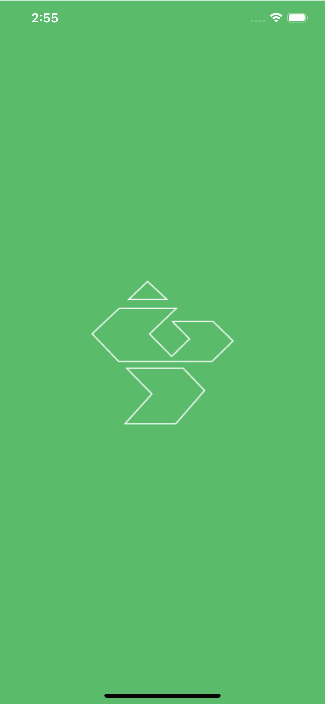 | 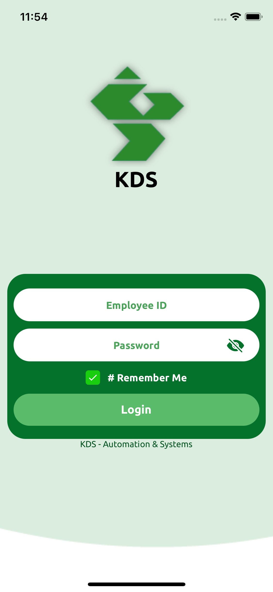 | 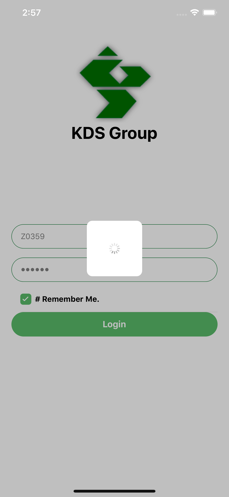 |
| 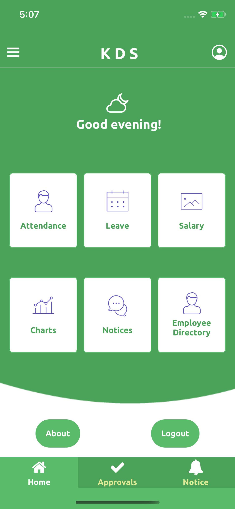 | 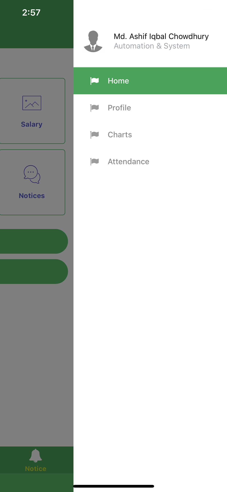 | 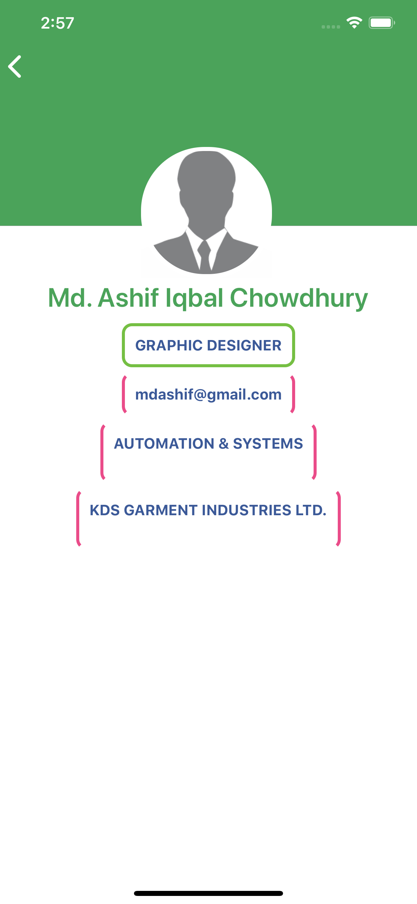 | 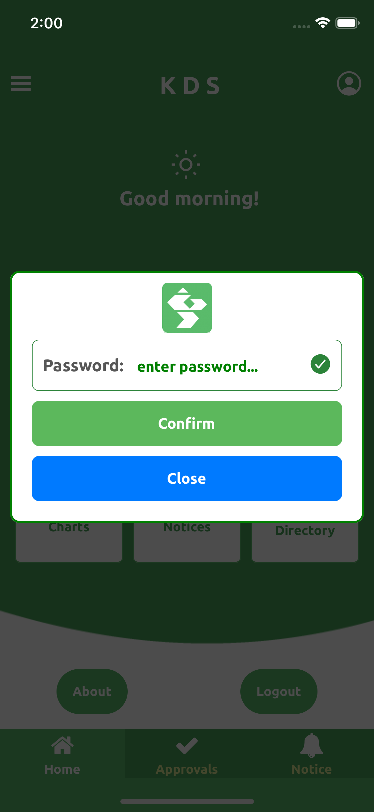 |
| 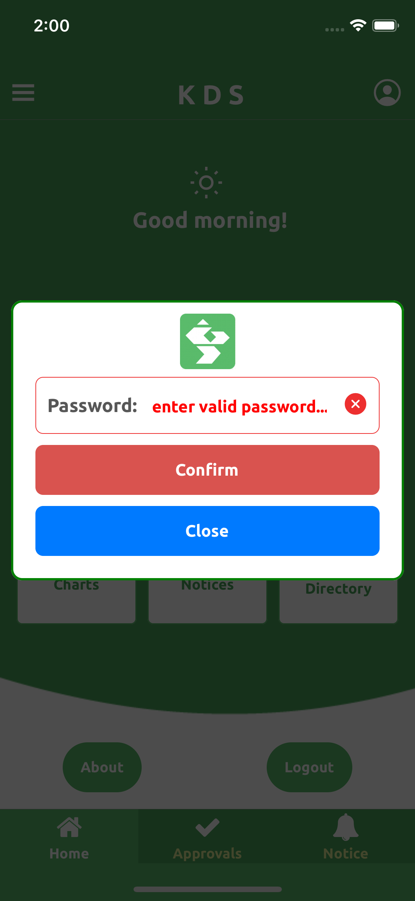 | 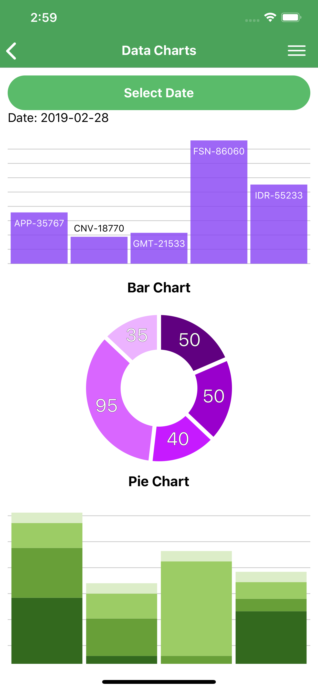 | 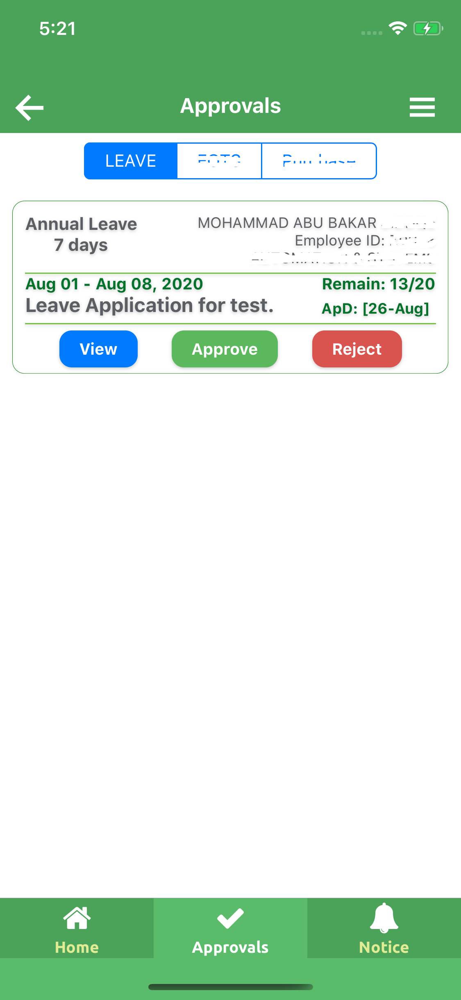 | 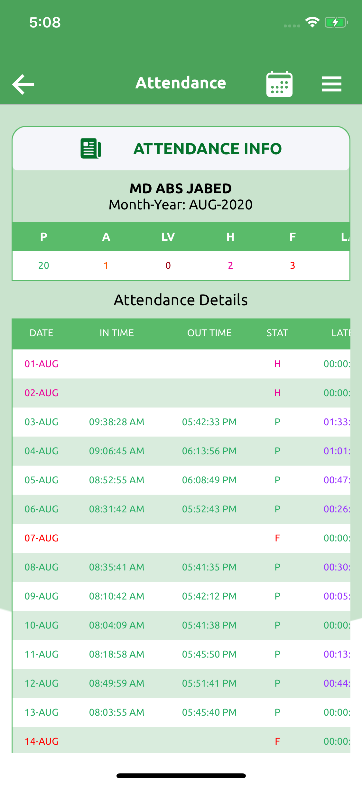 |
| 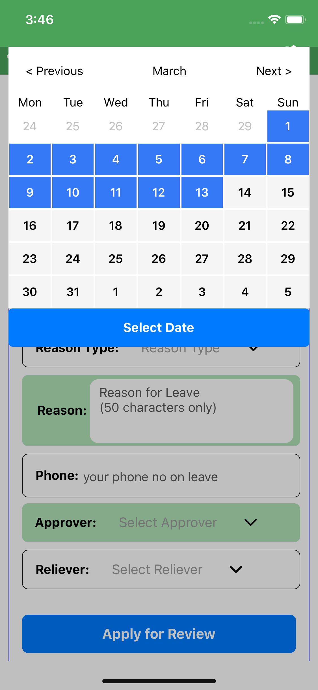 | 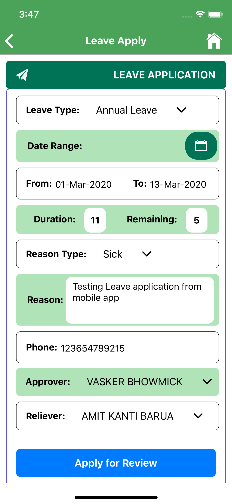 | 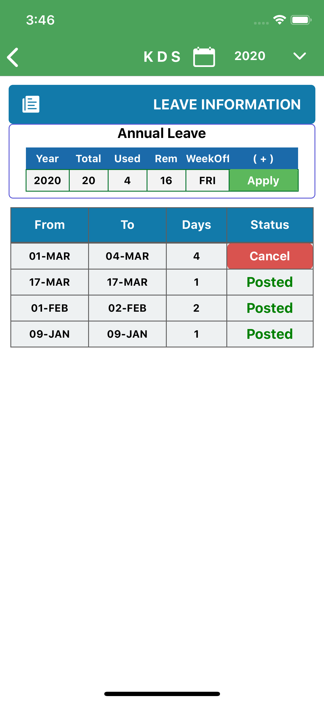 | 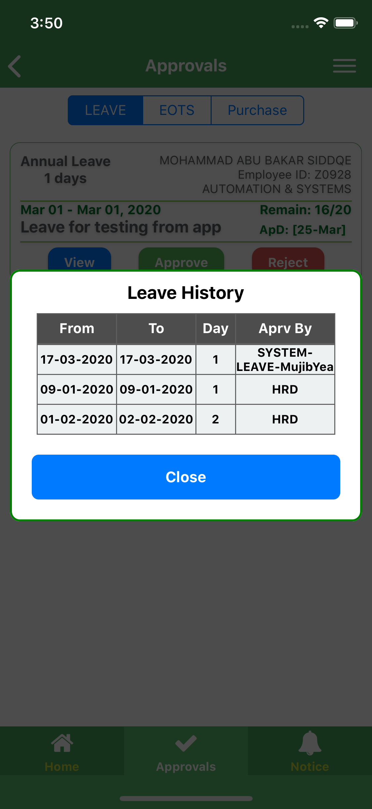 |

