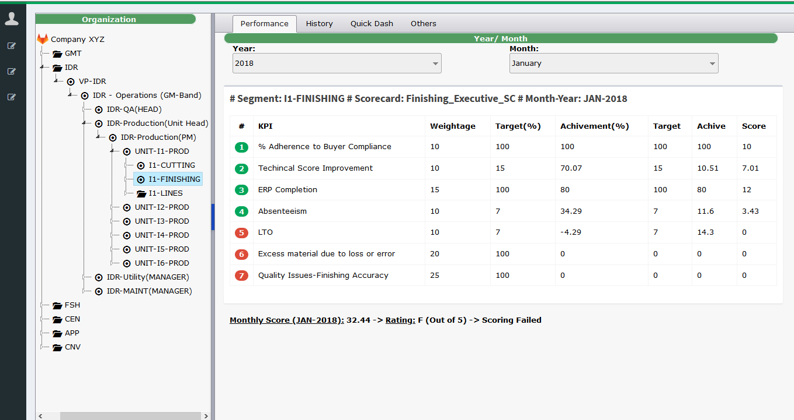
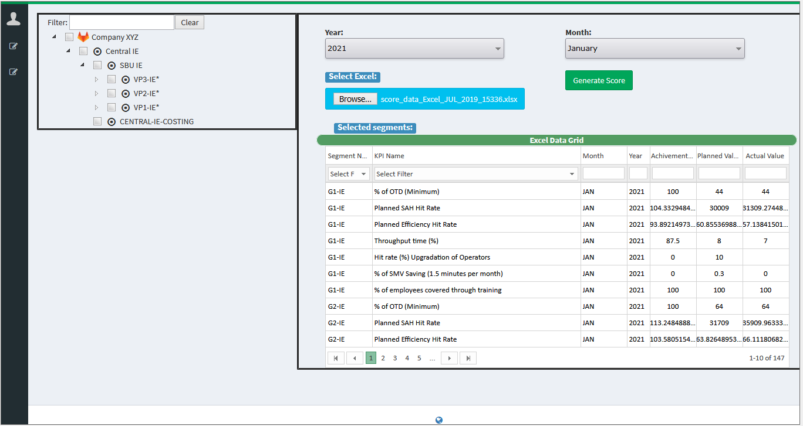

# Performance Measurement System (PMS)

Performance Measurement Web application is for measuring company growth based on company Goals, Objectives and Key Performance Indicators (KPI).

## Built with
* **C#**
* **ASP.NET (MVC)**
* **Entity Framework**
* **Javascript**
* **MSSQL**
* **git**

## Application walk-through

## Web Screenshots

