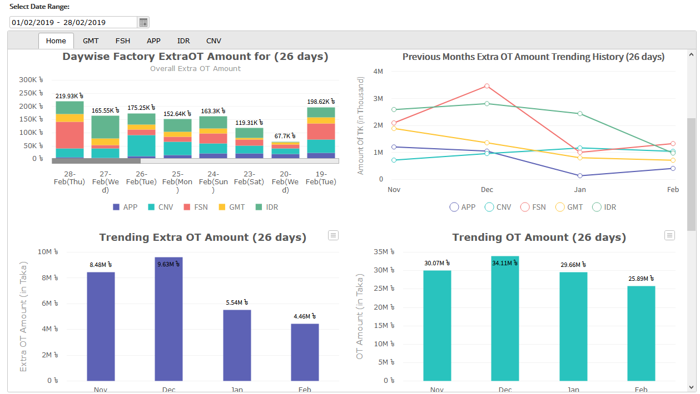
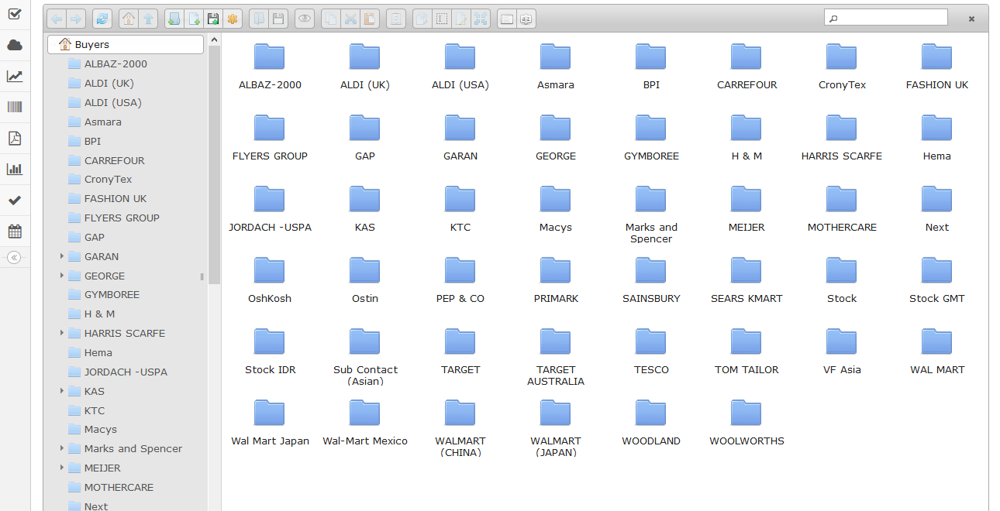
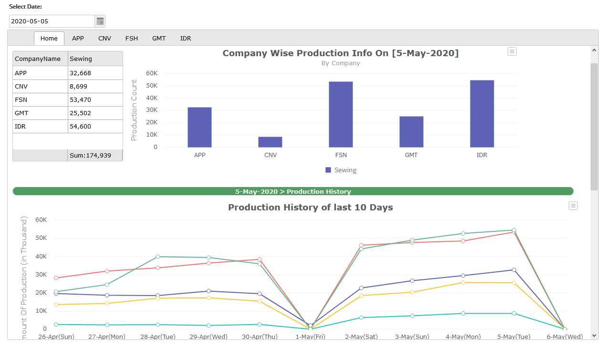

# Production, Efficiency & Forecasting Dashboard

Visual dashboard for tracking Production history, forecasting, Costing and Efficiency that helps management level decision making.

## Built with
* **C#**
* **ASP.NET (MVC)**
* **Entity Framework**
* **Javascript**
* **MSSQL**
* **WebApi**
* **JWT**
* **git**

## Application walk-through

## Web Screenshots

