# Waves of Cox's Bazar Mobile Application

Mobile application for Cox's Bazar Tourism powred by Cox's Bazar DC Office.

## Built with
* **Java**
* **php**
* **Rest-Api**
* **Javascript**
* **MySQL**
* **Firebase Cloud Messaging**
* **Realtime-DB**
* **Google Map Api**
* **GPS Sensor**
* **git**

## App inauguration news

[**bangladesh.gov.bd**](https://goo.gl/BMxZ3s)

## App walk-through video

## App Screenshots
|||||
|:---:|:---:|:---:|:---:|
| 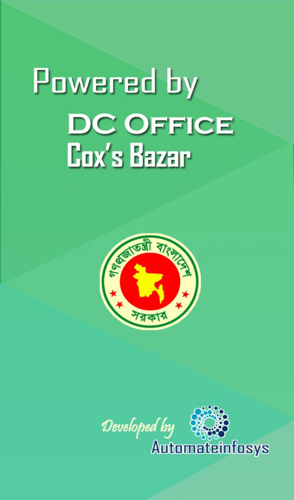 | 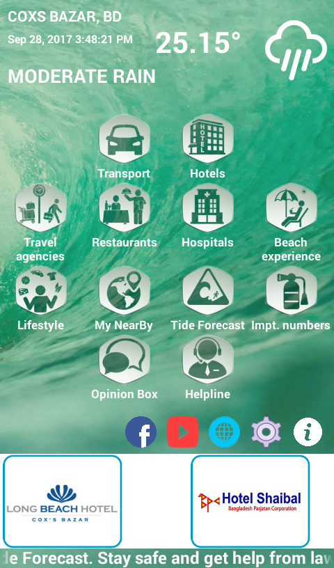 | 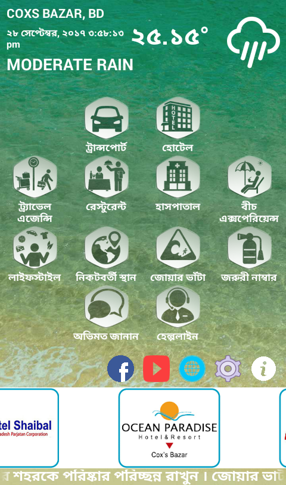 | 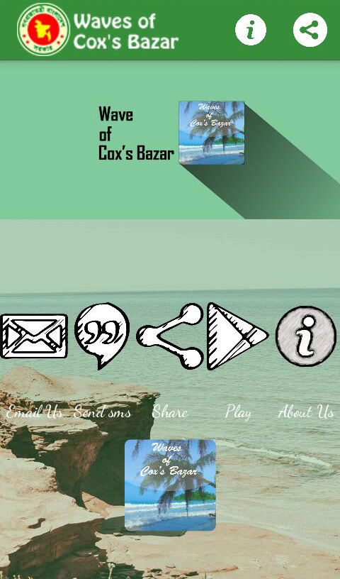 |
| 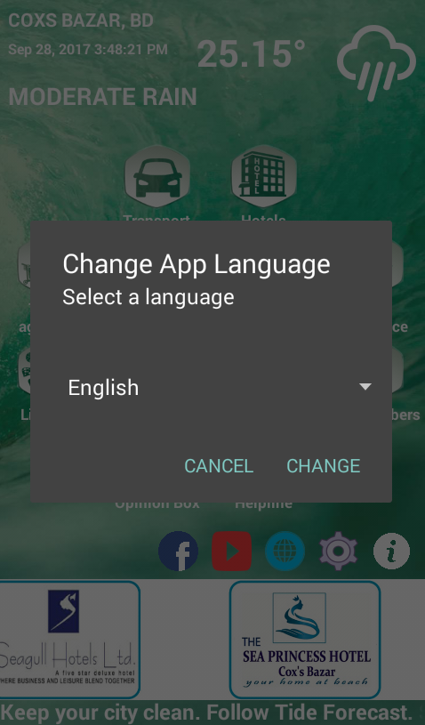 | 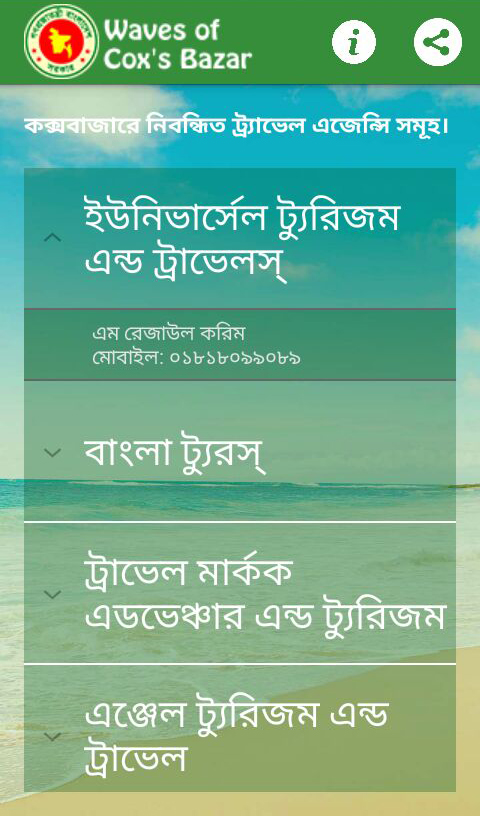 | 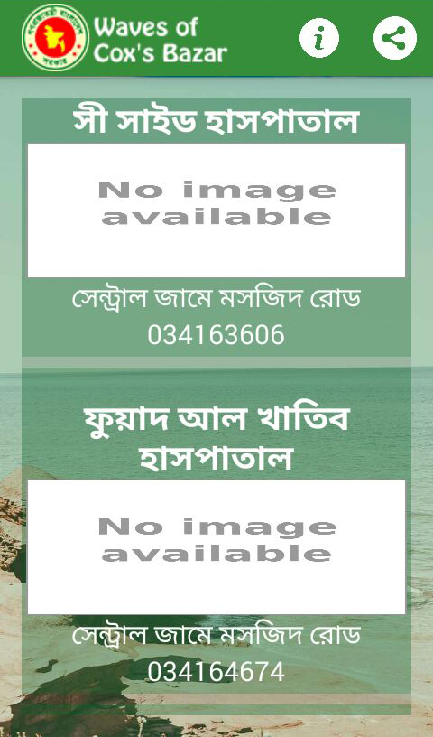 | 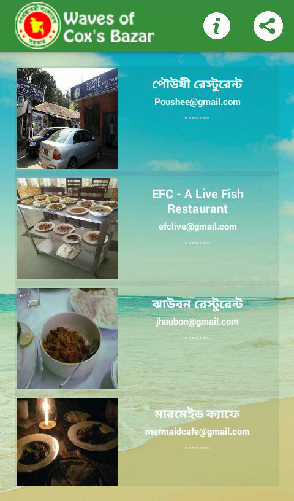 |
|  | 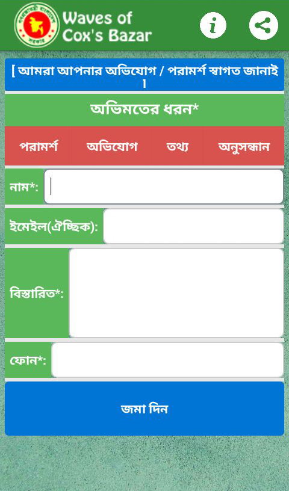 | 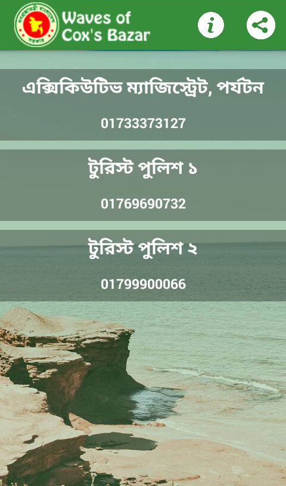 | 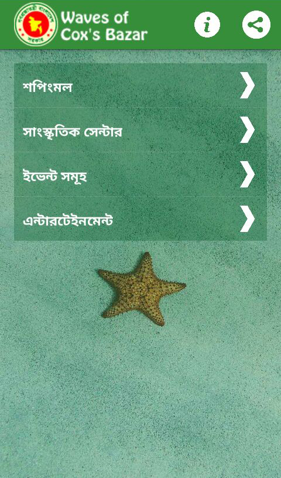 |

## Availability

[**Apkpure**](https://apkpure.com/waves-of-cox-s-bazar/com.parvez_n_jabed_co.waves_of_coxbazar)
